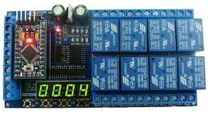

# 8 channel relay extension based on IO22D08

There is a nice and cheap board available from china manufactures that has 8 relays and some input and button
all on one board, which all can be controlled by a simple arduino mini pro.

The way the board works is described [here](https://werner.rothschopf.net/microcontroller/202104_arduino_pro_mini_relayboard_IO22D08_en.htm).

So took the code from Werner and added some I2C control logic using the Wire library e voila, ready to use with TILT!Audio.